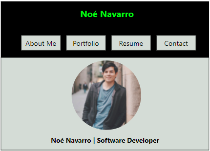

  

# Personal Website

## Description

This repository contains the code that produces my personal website. It was built using `React` to produce a single page document containing various tabs that give some background on myself and porjects I've done in the past. 

[Happy browsing](http://nnavarr.github.io/portfolio)
